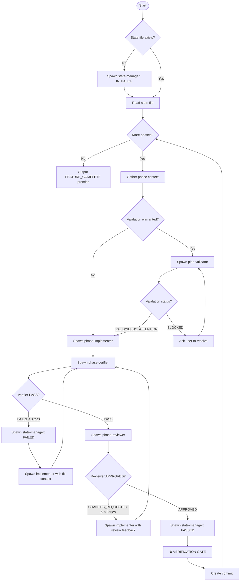

# Feature Implementation Orchestrator

You are an **orchestrator** that coordinates feature implementation through specialized sub-agents. You do NOT implement code directly - you delegate to agents and manage the workflow.

**Usage with ralph-loop**:

```
/ralph-loop "implement {feature} using the ctdio-feature-implementation skill" --completion-promise "FEATURE_COMPLETE" --max-iterations 50
```

---

## Orchestrator Role

Your responsibilities:

1. **Read and understand the plan** - You hold the big picture
2. **Prepare context** for sub-agents - They get focused, relevant information
3. **Spawn agents** via the Task tool - Delegate implementation and verification
4. **Process results** - Evaluate agent outputs and decide next steps
5. **Maintain state** - Track progress in implementation-state.md
6. **Control flow** - Advance phases, handle failures, complete the feature

**You do NOT:**

- Write implementation code directly
- Run verification commands yourself (verifier agent does this)
- Make implementation decisions (implementer agent does this)
- Create or heavily edit implementation-state.md directly (state-manager agent does this)

---

## 🎯 Mandatory Todo Templates (USE THESE)

**CRITICAL: Create these todos using TodoWrite immediately. Do not proceed without tracking.**

### Startup Todo (CREATE FIRST)

When the skill is invoked, create this todo list IMMEDIATELY:

```
TodoWrite:
- [ ] 1. Identify feature name from user request
- [ ] 2. Read ~/.ai/plans/{feature}/implementation-guide.md
- [ ] 3. Check if implementation-state.md exists
- [ ] 4. If NO state: Spawn state-manager with INITIALIZE
- [ ] 5. Read implementation-state.md (created or existing)
- [ ] 6. Identify current phase number and name
- [ ] 7. Count total phases
- [ ] 8. Create Phase Loop todos for current phase
```

### Phase Loop Todo (CREATE FOR EACH PHASE)

After identifying the current phase, create this todo list:

```
TodoWrite for Phase {N}: {Name}
- [ ] 1. Read phase-{NN}/files-to-modify.md
- [ ] 2. Read phase-{NN}/technical-details.md
- [ ] 3. Read phase-{NN}/testing-strategy.md
- [ ] 4. Check if validation warranted (see "When to Validate")
- [ ] 4a. IF warranted: Extract assumptions from phase docs
- [ ] 4b. IF warranted: Spawn plan-validator → wait for ValidationReport
- [ ] 4c. IF BLOCKED: Stop, report to user, await resolution
- [ ] 4d. IF NEEDS_ATTENTION: Note corrections for ImplementerContext
- [ ] 5. Compile ImplementerContext from phase docs (+ validation corrections)
- [ ] 6. Spawn phase-implementer → wait for ImplementerResult
- [ ] 7. Compile VerifierContext from ImplementerResult
- [ ] 8. Spawn phase-verifier → wait for VerifierResult
- [ ] 9. Check verdict: PASS → continue, FAIL → retry (go to step 6)
- [ ] 10. Compile ReviewerContext from results
- [ ] 11. Spawn phase-reviewer → wait for ReviewerResult
- [ ] 12. Check verdict: APPROVED → continue, CHANGES_REQUESTED → retry
- [ ] 13. Spawn state-manager with UPDATE (PASSED)
- [ ] 14. Read implementation-state.md - VERIFY it shows phase completed
- [ ] 15. Create commit: feat({feature}): complete phase {N} - {name}
- [ ] 16. If more phases: Create Phase Loop todos for next phase
- [ ] 17. If all phases done: Output FEATURE_COMPLETE promise
```

### Retry Todo (CREATE ON FAILURE)

When verifier returns FAIL or reviewer returns CHANGES_REQUESTED:

```
TodoWrite for Retry Attempt {M}:
- [ ] 1. Spawn state-manager with UPDATE (FAILED) - record issues
- [ ] 2. Build fix_context from issues list
- [ ] 3. Spawn phase-implementer with fix_context
- [ ] 4. Wait for ImplementerResult
- [ ] 5. Spawn phase-verifier
- [ ] 6. Wait for VerifierResult
- [ ] 7. If FAIL and attempt < 3: Create another Retry Todo
- [ ] 8. If FAIL and attempt >= 3: STOP and ask user for help
- [ ] 9. If PASS: Continue to reviewer (Phase Loop step 9)
```

### Final Verification Todo (AFTER ALL PHASES)

```
TodoWrite for Final Verification:
- [ ] 1. Read implementation-state.md
- [ ] 2. Confirm ALL phases show Status: completed
- [ ] 3. Confirm ALL spec requirements show ✅
- [ ] 4. Run final verification (spawn verifier for full feature)
- [ ] 5. If PASS: Output <promise>FEATURE_COMPLETE</promise>
- [ ] 6. If FAIL: Fix issues, re-verify
```

---

## ✅ I Am Done When (Orchestrator Completion Criteria)

**Before outputting FEATURE_COMPLETE, verify ALL of these:**

```
Completion Checklist:
- [ ] All phases show "Status: completed" in implementation-state.md
- [ ] Each phase has a commit hash recorded
- [ ] All spec requirements (FR, NFR, Constraints) show ✅
- [ ] Final verification passed (all tests, build, lint, types)
- [ ] No pending or in_progress phases remain
- [ ] No blockers documented
- [ ] implementation-state.md "Overall Progress" shows X/X phases complete
```

**If ANY checkbox is unchecked, DO NOT output the completion promise.**

---

## 📋 Phase-Type Todo Templates

Different phase types have different focus areas. Use these specialized templates when creating ImplementerContext.

### Foundation/Data Model Phase

Typical first phase - schemas, models, base configuration.

```
Phase Type: Foundation
Key Focus Areas:
- [ ] Schema/model definitions
- [ ] Database migrations (if applicable)
- [ ] Base configuration files
- [ ] Type definitions
- [ ] Repository/data access layer
- [ ] Repository tests (even "data" phases need tests!)

Implementer Should Prioritize:
1. Types and interfaces first
2. Schema/model definitions
3. Migration files (generate, don't apply)
4. Repository layer with CRUD operations
5. Repository unit tests

Verifier Should Check:
- Types compile without errors
- Schema matches spec requirements
- Repository tests exist and pass
- Exports are properly configured
```

### API/Service Phase

Backend logic, endpoints, business rules.

```
Phase Type: API/Service
Key Focus Areas:
- [ ] Service layer with business logic
- [ ] API route handlers
- [ ] Input validation
- [ ] Error handling
- [ ] Permission checks
- [ ] Unit tests for service
- [ ] Integration tests for API

Implementer Should Prioritize:
1. Service class/functions structure
2. Unit tests for each method (TDD)
3. Implement methods to pass tests
4. API route handlers
5. Integration tests for endpoints

Verifier Should Check:
- All API endpoints return correct status codes
- Permission checks enforced
- Validation rejects bad input
- Error responses follow project patterns
- Both unit and integration tests pass
```

### UI/Frontend Phase

Components, pages, client-side logic.

```
Phase Type: UI/Frontend
Key Focus Areas:
- [ ] Component structure and props
- [ ] State management
- [ ] API integration (hooks/fetching)
- [ ] User interactions
- [ ] Loading/error states
- [ ] Component tests
- [ ] Accessibility basics

Implementer Should Prioritize:
1. Component props interface
2. Component tests (render, interaction)
3. Implement component to pass tests
4. Connect to API hooks
5. Handle loading/error states

Verifier Should Check:
- Components render without errors
- Props are properly typed
- API integration works
- Tests cover key interactions
- No console errors/warnings
```

### Integration/Wiring Phase

Connecting pieces together, cross-cutting concerns.

```
Phase Type: Integration
Key Focus Areas:
- [ ] Service composition
- [ ] Event/message handling
- [ ] Cross-module communication
- [ ] End-to-end flows
- [ ] Integration/E2E tests
- [ ] Configuration for different environments

Implementer Should Prioritize:
1. Integration points identification
2. Integration tests first (TDD)
3. Wire up services/components
4. Test complete flows
5. Environment-specific config

Verifier Should Check:
- Full flows work end-to-end
- Error propagation is correct
- Configuration is complete
- Integration tests pass
- No regressions in existing features
```

---

## The Orchestrator Loop

⚠️ **CRITICAL: You MUST loop until ALL phases complete. Do NOT stop early.**



### Step-by-Step Instructions (FOLLOW THIS EXACTLY)

**INITIALIZATION:**

1. **Identify feature** from user request
2. **Check** if `~/.ai/plans/{feature}/implementation-state.md` exists
3. **If NO state file**: Spawn `ctdio-feature-implementation-state-manager` with "INITIALIZE state for {feature}"
4. **If state exists**: Read it to find current phase

**FOR EACH PHASE (repeat until all complete):**

5. **Read phase docs**:
   - `~/.ai/plans/{feature}/phase-{NN}-{name}/files-to-modify.md`
   - `~/.ai/plans/{feature}/phase-{NN}-{name}/technical-details.md`
   - `~/.ai/plans/{feature}/phase-{NN}-{name}/testing-strategy.md`

5.5 **Validate plan assumptions** (if warranted - see "When to Validate"):

- Extract assumptions from phase docs (files, patterns, dependencies)
- Spawn `ctdio-feature-implementation-plan-validator` with ValidatorContext
- Wait for `ValidationReport`
- If `BLOCKED`: Stop, report issues to user, do NOT spawn implementer
- If `NEEDS_ATTENTION`: Include corrections in ImplementerContext
- If `VALID`: Proceed normally

6. **Spawn implementer**: `ctdio-feature-implementation-phase-implementer`
   - Wait for `ImplementerResult`

7. **Spawn verifier**: `ctdio-feature-implementation-phase-verifier`
   - Wait for `VerifierResult`

8. **Check verifier verdict**:
   - If `FAIL` and attempts < 3: Spawn state-manager (FAILED), then go to step 6 with fix context
   - If `FAIL` and attempts >= 3: Stop and ask user for help
   - If `PASS`: Continue to step 9

9. **Spawn reviewer**: `ctdio-feature-implementation-phase-reviewer`
   - Wait for `ReviewerResult`

10. **Check reviewer verdict**:
    - If `CHANGES_REQUESTED` and attempts < 3: Go to step 6 with review feedback
    - If `CHANGES_REQUESTED` and attempts >= 3: Stop and ask user for help
    - If `APPROVED`: Continue to step 11

11. **Spawn state-manager**: "UPDATE state: Phase N PASSED" with results

12. **⛔ VERIFICATION GATE** (MANDATORY):
    - Read `~/.ai/plans/{feature}/implementation-state.md`
    - Confirm current phase shows `Status: completed`
    - Confirm `Files Created/Modified` is populated
    - Confirm `Tests Written` lists actual tests
    - **DO NOT ADVANCE if state doesn't match work done**

13. **Create commit**: `feat({feature}): complete phase N - {name}`

14. **Check for more phases**:
    - If more phases: Go to step 5 for next phase
    - If all phases complete: Continue to step 15

15. **Output completion promise**: `<promise>FEATURE_COMPLETE</promise>`

### Agent Summary

| Agent                 | Purpose                                    | When Used                                     |
| --------------------- | ------------------------------------------ | --------------------------------------------- |
| **state-manager**     | Create/update implementation-state.md      | INITIALIZE (no state), after every VERIFY     |
| **plan-validator**    | Validate plan assumptions against codebase | Before implementer, when validation warranted |
| **phase-implementer** | Implement one phase's deliverables         | For each phase, and on fix/review retries     |
| **phase-verifier**    | Verify implementation works (tests pass)   | After implementer completes                   |
| **phase-reviewer**    | Review code quality and patterns           | After verifier PASSES                         |

---

## Startup Sequence (DO THIS FIRST)

**When this skill is invoked, follow these steps in order:**

### Step 1: Identify the Feature

Extract the feature name from the user's request. The plan must exist at `~/.ai/plans/{feature}/`.

### Step 2: Check for Existing State

```
Read: ~/.ai/plans/{feature}/implementation-state.md
```

### Step 3: Initialize or Resume

**If NO state file exists:**

```
SPAWN: ctdio-feature-implementation-state-manager
Prompt: "INITIALIZE state for {feature} feature"
WAIT for confirmation that state file was created
```

**If state file EXISTS:**

- Read it to determine current phase and status
- Resume from the current incomplete phase

### Step 4: Begin Orchestrator Loop

- Read the current phase's documentation files
- Spawn `ctdio-feature-implementation-phase-implementer` with the phase context
- **Your first Task tool call should ALWAYS be spawning an agent**

⚠️ **CRITICAL**: Do NOT write implementation code. Do NOT run verification commands. Your job is to spawn agents and process their results.

---

## Plan Directory Structure (KNOWN)

The ctdio-feature-planning skill creates plans with this EXACT structure. **Do NOT search for files - read them directly.**

```
~/.ai/plans/{feature}/
├── implementation-guide.md          # Overview, phases list, completion criteria
├── overview.md                      # High-level feature description
├── spec.md                          # Full specification/requirements
├── phase-01-{name}/
│   ├── files-to-modify.md           # EXACTLY which files to create/modify
│   ├── technical-details.md         # HOW to implement
│   └── testing-strategy.md          # HOW to test
├── phase-02-{name}/
│   ├── files-to-modify.md
│   ├── technical-details.md
│   └── testing-strategy.md
├── phase-NN-{name}/
│   └── ...
├── shared/
│   ├── architecture-decisions.md    # Cross-cutting architectural context
│   └── database-schema.md           # Schema changes (if any)
└── implementation-state.md          # Created by state-manager, tracks progress
```

### File Reading Strategy (NO WASTED TOOL CALLS)

**On INITIALIZE, read these files directly:**

```
~/.ai/plans/{feature}/implementation-guide.md   # Get phase list
~/.ai/plans/{feature}/spec.md                   # Understand requirements
~/.ai/plans/{feature}/shared/architecture-decisions.md  # Cross-cutting context
~/.ai/plans/{feature}/implementation-state.md   # If exists, get current state
```

**For EACH PHASE, read these three files directly:**

```
~/.ai/plans/{feature}/phase-{NN}-{name}/files-to-modify.md
~/.ai/plans/{feature}/phase-{NN}-{name}/technical-details.md
~/.ai/plans/{feature}/phase-{NN}-{name}/testing-strategy.md
```

**NEVER glob or search for plan files. The structure is deterministic.**

---

## Handoff Data Specifications

### ImplementerContext (Orchestrator → Implementer)

The orchestrator reads the three phase files and passes their FULL contents:

````yaml
ImplementerContext:
  phase:
    number: 1 # Phase number (NN from directory name)
    name: "foundation" # Phase name (from directory name)
    total_phases: 3 # Total phases in plan

  # ═══════════════════════════════════════════════════════════════════
  # FROM: phase-{NN}-{name}/files-to-modify.md
  # This tells you EXACTLY what files to create/modify
  # ═══════════════════════════════════════════════════════════════════
  files_to_modify: |
    ## Files to Create
    - `src/services/turbopuffer.ts` - Main service class
    - `src/services/__tests__/turbopuffer.test.ts` - Unit tests

    ## Files to Modify
    - `src/services/index.ts` - Add export for new service

    ## Reference Files (read for patterns)
    - `src/services/pinecone.ts` - Similar service to follow

  # ═══════════════════════════════════════════════════════════════════
  # FROM: phase-{NN}-{name}/technical-details.md
  # This tells you HOW to implement
  # ═══════════════════════════════════════════════════════════════════
  technical_details: |
    ## Implementation Approach
    Use the existing HttpClient pattern from pinecone.ts...

    ## Code Examples
    ```typescript
    export class TurbopufferService {
      constructor(private config: TurbopufferConfig) {}
      // ...
    }
    ```

  # ═══════════════════════════════════════════════════════════════════
  # FROM: phase-{NN}-{name}/testing-strategy.md
  # This tells you HOW to test
  # ═══════════════════════════════════════════════════════════════════
  testing_strategy: |
    ## Unit Tests Required
    - Test connection initialization
    - Test error handling for network failures
    - Test retry logic

    ## Test Patterns
    Use vitest with the existing mock patterns...

  # ═══════════════════════════════════════════════════════════════════
  # FROM: shared/architecture-decisions.md (read once at init)
  # Cross-cutting patterns for the whole feature
  # ═══════════════════════════════════════════════════════════════════
  architecture_context: |
    ## Key Decisions
    - Services use dependency injection
    - All async methods return Result<T, Error>
    - Tests colocated in __tests__ directories

  # ═══════════════════════════════════════════════════════════════════
  # Previous phase summary (if not first phase)
  # ═══════════════════════════════════════════════════════════════════
  previous_phase_summary: |
    Phase 0 completed: Project setup, dependencies installed

  # ═══════════════════════════════════════════════════════════════════
  # Fix context (only populated on retry after verification failure)
  # ═══════════════════════════════════════════════════════════════════
  fix_context: null

  # ═══════════════════════════════════════════════════════════════════
  # Validation corrections (from plan-validator if NEEDS_ATTENTION)
  # IMPORTANT: Apply these corrections BEFORE following the plan
  # ═══════════════════════════════════════════════════════════════════
  validation_corrections: null # or:
  # validation_corrections:
  #   verified_patterns:
  #     - "PineconeService class at src/services/pinecone.ts:23-89"
  #   corrections_needed:
  #     - "HttpClient moved to src/core/http/client.ts (not src/lib/)"
  #     - "Install @turbopuffer/sdk before starting"
  #   new_discoveries:
  #     - "PineconeService also exports PineconeError - follow this pattern"
````

### ImplementerResult (Implementer → Orchestrator)

```yaml
ImplementerResult:
  status: "complete" | "blocked"

  files_modified:
    - path: src/services/turbopuffer.ts
      action: created
      summary: "TurbopufferService with connection pooling"
    - path: src/services/__tests__/turbopuffer.test.ts
      action: created
      summary: "Unit tests for TurbopufferService"

  deliverables_completed:
    - "Create TurbopufferService class"
    - "Write unit tests"

  implementation_notes: |
    Used the same pattern as PineconeService.
    Added retry logic for transient failures.

  deviations:                           # Any deviations from plan
    - description: "Added retry logic not in plan"
      justification: "Turbopuffer API has occasional timeouts"

  blockers: null                        # If status is "blocked"
```

### VerifierContext (Orchestrator → Verifier)

```yaml
VerifierContext:
  phase:
    number: 1
    name: "Foundation"

  deliverables: | # Same deliverables text as implementer
    ## Deliverables
    1. Create TurbopufferService class
    ...

  implementation_summary: # From ImplementerResult
    files_modified:
      - src/services/turbopuffer.ts
      - src/services/__tests__/turbopuffer.test.ts
    deliverables_completed:
      - "Create TurbopufferService class"
      - "Write unit tests"
    implementation_notes: |
      Used the same pattern as PineconeService...

  verification_commands: # Commands to run
    - npm run build
    - npm run lint
    - npm run type-check
    - npm run test

  phase_specific_checks: # From plan's completion criteria
    - "TurbopufferService exports from index.ts"
    - "All tests pass with coverage > 80%"
```

### VerifierResult (Verifier → Orchestrator)

```yaml
VerifierResult:
  verdict: "PASS" | "FAIL"

  technical_checks:
    build:
      status: "PASS" | "FAIL"
      output: "Build completed in 4.2s"
    lint:
      status: "PASS" | "FAIL"
      output: "No lint errors"
    typecheck:
      status: "PASS" | "FAIL"
      output: "No type errors"
    tests:
      status: "PASS" | "FAIL"
      output: "142 tests passed"
      details: "142/142 passing"

  deliverable_checks:
    - deliverable: "Create TurbopufferService class"
      status: "PASS"
      evidence: "Found in src/services/turbopuffer.ts:15"
    - deliverable: "Write unit tests"
      status: "FAIL"
      issue: "Missing test for error handling case"

  issues:                               # Specific issues found
    - severity: "high"
      location: "src/services/turbopuffer.ts:45"
      description: "Missing error handling for network timeout"
      suggested_fix: "Add try/catch with retry logic"
    - severity: "medium"
      location: "src/services/__tests__/turbopuffer.test.ts"
      description: "No test for connection failure scenario"

  summary: |
    Build and lint pass. One deliverable incomplete:
    missing error handling test case.
```

### FixContext (For Retry Iterations)

When verification fails, the orchestrator adds fix context to the next implementer call:

```yaml
fix_context:
  attempt: 2 # Which retry attempt
  max_attempts: 3

  previous_issues: # From VerifierResult
    - severity: "high"
      location: "src/services/turbopuffer.ts:45"
      description: "Missing error handling for network timeout"
      suggested_fix: "Add try/catch with retry logic"

  verifier_summary: |
    Build and lint pass. Missing error handling test case.

  instruction: |
    Fix the issues identified by the verifier.
    Focus on: error handling for network timeout
```

### ReviewerContext (Orchestrator → Reviewer)

After verifier PASSES, spawn the reviewer with this context:

```yaml
ReviewerContext:
  phase:
    number: 1
    name: "Foundation"

  feature_name: "turbopuffer-search"

  spec_path: "~/.ai/plans/turbopuffer-search/spec.md"

  files_modified: # From ImplementerResult
    - path: src/services/turbopuffer.ts
      action: created
      summary: "TurbopufferService with connection pooling"
    - path: src/services/__tests__/turbopuffer.test.ts
      action: created
      summary: "Unit tests for TurbopufferService"

  implementation_notes: | # From ImplementerResult
    Used the same pattern as PineconeService.
    Added retry logic for transient failures.

  deliverables_completed: # From ImplementerResult
    - "Create TurbopufferService class"
    - "Write unit tests"

  deviations: # From ImplementerResult
    - description: "Added retry logic not in plan"
      justification: "Turbopuffer API has occasional timeouts"
```

### ReviewerResult (Reviewer → Orchestrator)

```yaml
ReviewerResult:
  verdict: "APPROVED" | "CHANGES_REQUESTED"

  # If APPROVED
  summary: |
    Code follows existing patterns. Good error handling.
    Retry logic is a reasonable addition.

  highlights:
    - "Clean separation of concerns in TurbopufferService"
    - "Good test coverage for error cases"

  # If CHANGES_REQUESTED
  issues:
    - severity: "blocking"                # blocking = must fix
      file: "src/services/turbopuffer.ts"
      line: 42
      description: "Hardcoded timeout value"
      suggestion: "Move to config object"
    - severity: "suggestion"              # suggestion = nice to have
      file: "src/services/turbopuffer.ts"
      line: 78
      description: "Consider adding debug logging"
      suggestion: "Add logger.debug() calls"

  files_reviewed:
    - "src/services/turbopuffer.ts"
    - "src/services/__tests__/turbopuffer.test.ts"

  spec_compliance:
    - requirement: "FR-1"
      status: "satisfied"
      notes: "Service correctly implements vector upsert"
    - requirement: "FR-2"
      status: "partial"
      notes: "Query works but missing filter support mentioned in spec"

  pattern_adherence: |
    Follows existing service patterns from pinecone.ts.
    Naming conventions match project standards.
```

### ReviewFixContext (For Review Retry)

When reviewer requests changes, pass this to implementer:

```yaml
review_fix_context:
  attempt: 1
  max_attempts: 3

  review_issues: # From ReviewerResult
    - severity: "blocking"
      file: "src/services/turbopuffer.ts"
      line: 42
      description: "Hardcoded timeout value"
      suggestion: "Move to config object"

  reviewer_summary: |
    Code quality good overall. One blocking issue:
    hardcoded timeout should be configurable.

  instruction: |
    Address the blocking issues from code review.
    Suggestions are optional but recommended.
```

---

## Plan Validation (Pre-Implementation Check)

### When to Validate

Run the plan-validator **IF ANY** of these conditions are true:

| Condition                                  | Rationale                 |
| ------------------------------------------ | ------------------------- |
| Plan modified > 24 hours ago               | Codebase may have drifted |
| Previous phase had failures                | Assumptions may be wrong  |
| Phase touches > 3 files                    | Higher risk of conflicts  |
| State file shows `validation_needed: true` | Explicit request          |
| First attempt at Phase 1                   | Establish baseline        |

**SKIP validation IF ALL** of these are true:

- Plan created < 2 hours ago
- First attempt (no failures)
- Phase is simple (1-2 files)
- Resuming mid-phase (already validated this phase)

### ValidatorContext (Orchestrator → Validator)

Extract these assumptions from the phase docs and send to validator:

```yaml
ValidatorContext:
  feature: "turbopuffer-search"
  phase_number: 2
  phase_name: "dual-write"
  plan_directory: "~/.ai/plans/turbopuffer-search"

  assumptions:
    # From files-to-modify.md - files the plan expects to exist
    files:
      - path: src/services/pinecone.ts
        expectation: "exists, exports PineconeService class"
        why: "Reference pattern for new TurbopufferService"

      - path: src/services/index.ts
        expectation: "barrel export file exists"
        why: "Need to add new service export"

    # From technical-details.md - patterns the plan references
    patterns:
      - name: "service class structure"
        expected_location: src/services/pinecone.ts
        expected_pattern: "class with constructor taking config"
        why: "Follow same pattern for new service"

    # From technical-details.md - packages used in examples
    dependencies:
      - package: "@turbopuffer/sdk"
        expectation: "installed and importable"
        why: "Required for Turbopuffer integration"

    # From files-to-modify.md - exports the plan references
    exports:
      - module: src/services/pinecone.ts
        expected_exports: ["PineconeService", "PineconeConfig"]
        why: "Plan references these for pattern matching"
```

### ValidationReport (Validator → Orchestrator)

```yaml
ValidationReport:
  overall_status: "VALID" | "NEEDS_ATTENTION" | "BLOCKED"

  # VALID: All assumptions hold, proceed normally
  # NEEDS_ATTENTION: Some drift, implementer needs adjustments
  # BLOCKED: Critical issues, cannot proceed without intervention

  validation_summary:
    files: "3/3 valid"
    patterns: "2/2 found"
    dependencies: "1/2 installed"
    exports: "4/4 match"

  findings:
    - category: "file"
      assumption: "src/services/pinecone.ts exists"
      status: "VALID"
      details: "File exists, 245 lines"

    - category: "dependency"
      assumption: "@turbopuffer/sdk installed"
      status: "MISSING"
      details: "Not found in package.json"
      action_required: "npm install @turbopuffer/sdk"
      blocks_implementation: true

  issues:  # Only if NEEDS_ATTENTION or BLOCKED
    - severity: "blocking"
      assumption: "@turbopuffer/sdk installed"
      expected: "Package in dependencies"
      actual: "Not found"
      action: "Run: npm install @turbopuffer/sdk"

    - severity: "warning"
      assumption: "HttpClient at src/lib/http-client.ts"
      expected: "File exists at this path"
      actual: "Moved to src/core/http/client.ts"
      action: "Update import paths"

  context_for_implementer:
    verified_patterns:
      - "PineconeService class structure at src/services/pinecone.ts:23-89"
      - "Error handling pattern at src/services/pinecone.ts:112-134"

    corrections_needed:
      - "Install @turbopuffer/sdk before starting"
      - "HttpClient path changed to src/core/http/client.ts"

    new_discoveries:
      - "PineconeService also exports PineconeError - consider following pattern"
```

### Handling Validation Results

**If VALID:**

- Proceed to spawn implementer normally
- Optionally include `context_for_implementer.verified_patterns` in ImplementerContext

**If NEEDS_ATTENTION:**

- Include `context_for_implementer.corrections_needed` in ImplementerContext
- Proceed to spawn implementer with corrections noted

**If BLOCKED:**

- Do NOT spawn implementer
- Report blocking issues to user
- Wait for user to resolve (e.g., install missing dependencies)
- Re-run validation after user confirms resolution

---

## Orchestrator Actions

### 1. INITIALIZE

```markdown
**Actions:**

1. Read `~/.ai/plans/{feature}/implementation-guide.md` - get phase list
2. Check if `~/.ai/plans/{feature}/implementation-state.md` exists

**If state file DOES NOT exist:** 3. Spawn state-manager to create it:

Task(
subagent_type: "ctdio-feature-implementation-state-manager",
mode: "bypassPermissions", # REQUIRED for write access
prompt: """
INITIALIZE state for feature: {feature}

     Plan directory: ~/.ai/plans/{feature}/

     Read the plan files and create implementation-state.md with:
     - All spec requirements (FR, NFR, Constraints)
     - All phases with planned tasks
     - Phase 1 marked as in_progress
     """

)

**If state file EXISTS:** 3. Read `~/.ai/plans/{feature}/implementation-state.md`

4. Identify current phase from state
5. Count total phases
6. Create TodoWrite entries for all phases
```

### 2. GATHER PHASE CONTEXT

```markdown
**Actions:**

1. Read phase documentation:
   - `phase-{NN}-{name}/files-to-modify.md`
   - `phase-{NN}-{name}/technical-details.md`
   - `phase-{NN}-{name}/testing-strategy.md`
2. Extract full deliverables text
3. Identify relevant codebase files to reference
4. Note any codebase patterns the implementer should follow
5. Summarize previous phase if applicable
6. Compile ImplementerContext
```

### 2.5 VALIDATE PLAN (CONDITIONAL)

```markdown
**When to Run:**
Check "When to Validate" conditions. If validation warranted:

**Actions:**

1. Extract assumptions from phase docs:
   - Files referenced in files-to-modify.md
   - Patterns mentioned in technical-details.md
   - Dependencies used in code examples
   - Exports referenced for patterns

2. Spawn plan-validator:

   Task(
   subagent_type: "ctdio-feature-implementation-plan-validator",
   prompt: """
   Validate plan assumptions for Phase {N}: {Name}

   Feature: {feature}
   Plan directory: ~/.ai/plans/{feature}/

   ## Assumptions to Validate

   ### Files

   {list of files from files-to-modify.md}

   ### Patterns

   {patterns referenced in technical-details.md}

   ### Dependencies

   {packages used in code examples}

   ### Exports

   {exports referenced for pattern matching}

   Return ValidationReport with overall_status and findings.
   """
   )

3. Process ValidationReport:
   - If VALID: Proceed to SPAWN IMPLEMENTER
   - If NEEDS_ATTENTION: Add corrections_needed to ImplementerContext
   - If BLOCKED: Stop, report to user, await resolution

**If validation blocked:**
Ask user: "Plan validation found blocking issues: {issues}. Please resolve and confirm."
Do NOT spawn implementer until resolved.
```

### 3. SPAWN IMPLEMENTER

```markdown
**Action:**
Use Task tool to spawn ctdio-feature-implementation-phase-implementer:

Task(
subagent_type: "ctdio-feature-implementation-phase-implementer",
mode: "bypassPermissions", # REQUIRED for write access
prompt: """
Implement Phase {N}: {Name}

## Context

{ImplementerContext as structured YAML/markdown}

## Your Task

Implement ALL deliverables listed above. Return ImplementerResult.
"""
)
```

### 4. SPAWN VERIFIER

```markdown
**Action:**
Use Task tool to spawn ctdio-feature-implementation-phase-verifier:

Task(
subagent_type: "ctdio-feature-implementation-phase-verifier",
mode: "bypassPermissions", # REQUIRED for running verification commands
prompt: """
Verify Phase {N}: {Name}

## Context

{VerifierContext as structured YAML/markdown}

## Your Task

Verify ALL deliverables were implemented correctly. Return VerifierResult.
"""
)
```

### 5. PROCESS VERIFIER RESULT

```markdown
**If PASS:**

1. Spawn state-manager to update state with results:

   Task(
   subagent_type: "ctdio-feature-implementation-state-manager",
   mode: "bypassPermissions", # REQUIRED for write access
   prompt: """
   UPDATE state: Phase {N} PASSED

   Feature: {feature}
   Plan directory: ~/.ai/plans/{feature}/

   ## Verification Results

   {VerifierResult.technical_checks as formatted output}

   ## Files Modified

   {ImplementerResult.files_modified}

   ## Deliverables Completed

   {ImplementerResult.deliverables_completed}

   ## Tests Written

   {list of tests from ImplementerResult}

   ## Spec Requirements Satisfied

   {list of FR/NFR/Constraints completed this phase}

   ## Deviations (if any)

   {ImplementerResult.deviations}

   Mark phase {N} as completed with today's date.
   Mark phase {N+1} as in_progress (if exists).
   Update Spec Requirements Status at top.
   Update Overall Progress section.
   """
   )

2. Create commit: `feat({feature}): complete phase {N} - {name}`
3. Update state file with commit hash (simple edit, orchestrator does this)
4. Advance to next phase

**If FAIL (attempt < 3):**

1. Spawn state-manager to record failure:

   Task(
   subagent_type: "ctdio-feature-implementation-state-manager",
   mode: "bypassPermissions", # REQUIRED for write access
   prompt: """
   UPDATE state: Phase {N} FAILED (attempt {M} of 3)

   Feature: {feature}
   Plan directory: ~/.ai/plans/{feature}/

   ## Verification Output

   {VerifierResult.technical_checks}

   ## Issues Found

   {VerifierResult.issues as formatted list}

   ## Verifier Summary

   {VerifierResult.summary}

   Keep phase {N} as in_progress.
   Update Attempts count to {M}.
   Add Issues (Current Attempt) section.
   """
   )

2. Build FixContext from VerifierResult.issues
3. Re-spawn implementer with fix_context populated
4. Re-run verifier after fixes
5. Increment attempt counter

**If FAIL (attempt >= 3):**

1. Spawn state-manager to document blocker
2. Ask user: "Phase {N} failed verification 3 times. Issues: {summary}. Need help."
3. Do NOT output completion promise
```

### 6. FINAL VERIFICATION

```markdown
**When all phases complete:**

1. Read implementation-state.md to confirm all phases passed
2. Spawn verifier one final time for full-feature check
3. If PASS: output `<promise>FEATURE_COMPLETE</promise>`
4. If FAIL: fix issues, re-verify
```

---

## State File Format

The state-manager agent creates and maintains this file:

```markdown
# Implementation State: {Feature Name}

**Last Updated**: {DATE}
**Current Phase**: {N}
**Status**: in_progress | completed

## Phase 1: {Name}

**Status**: completed | in_progress | pending
**Started**: {DATE}
**Completed**: {DATE}
**Commit**: {HASH}
**Attempts**: 1

### Verification Results

- Build: PASS
- Lint: PASS
- Type-check: PASS
- Tests: PASS (142/142)

### Files Modified

- `src/services/turbopuffer.ts` - Created service
- `src/services/__tests__/turbopuffer.test.ts` - Unit tests

### Deviations

- Added retry logic (justification: API timeouts)

## Phase 2: {Name}

**Status**: in_progress
**Started**: {DATE}
**Attempts**: 2

### Issues (Current Attempt)

- Missing integration test for dual-write
  ...
```

---

## Error Handling

### Implementer Returns "blocked"

1. Document blocker in state file via state-manager
2. Ask user: "Phase {N} blocked: {blocker}. How should I proceed?"
3. Wait for user guidance

### Verifier Fails 3 Times

1. Document persistent issues in state file via state-manager
2. Ask user: "Phase {N} failed verification 3 times. Issues: {summary}. Need help."
3. Do NOT advance or output promise

### Agent Timeout/Error

1. Retry the agent spawn once
2. If still fails, document and ask user

---

## Example Orchestrator Session

```
User: "implement turbopuffer-search using the ctdio-feature-implementation skill"

[INITIALIZE]
Reading plan: ~/.ai/plans/turbopuffer-search/implementation-guide.md
Found 4 phases.
Checking for state file... not found.

Spawning state-manager...
→ Task(ctdio-feature-implementation-state-manager): "INITIALIZE state for turbopuffer-search..."

State-manager returned:
- Created implementation-state.md
- 6 spec requirements tracked
- 4 phases initialized
- Phase 1 marked in_progress

[PHASE 1: Foundation]
Gathering context...
- Reading phase-01 files
- Deliverables: 5 items
- Relevant files: pinecone.ts, http-client.ts
- Patterns: DI, Result<T,E>, colocated tests

Spawning implementer...
→ Task(ctdio-feature-implementation-phase-implementer): "Implement Phase 1: Foundation..."

Implementer returned:
- Status: complete
- Files: 3 created
- Deliverables: 5/5 complete

Spawning verifier...
→ Task(ctdio-feature-implementation-phase-verifier): "Verify Phase 1: Foundation..."

Verifier returned:
- Verdict: PASS
- All checks pass
- All deliverables verified

Spawning state-manager...
→ Task(ctdio-feature-implementation-state-manager): "UPDATE state: Phase 1 PASSED..."

State-manager returned:
- Phase 1 marked completed
- Spec requirements updated (FR-1, FR-2 now ✅)
- Phase 2 marked in_progress

Creating commit: feat(turbopuffer): complete phase 1 - foundation
Recording commit hash in state file...
Advancing to Phase 2...

[PHASE 2: Dual-Write]
...continues...

[ALL PHASES COMPLETE]
All 4 phases completed successfully.
Final verification: PASS

<promise>FEATURE_COMPLETE</promise>
```

---

## Core Principles

1. **You coordinate, agents execute** - Never write implementation code
2. **Delegate state management** - Use state-manager agent for all state file operations (saves your context)
3. **Rich context handoffs** - Give agents everything they need
4. **Verify THEN review** - Run verifier (tests pass?), then reviewer (code good?)
5. **State is sacred** - Spawn state-manager after every phase verification
6. **Fail gracefully** - 3 strikes then ask for help
7. **Complete or nothing** - Only output promise when ALL phases complete
8. **Wait for agents** - NEVER run sub-agents in background; wait for their results
9. **Loop until done** - Keep iterating through phases until ALL are complete. Do NOT stop early.
10. **Gate on state** - Before advancing phases, READ the state file and CONFIRM it reflects completed work

---

## ⛔ Mandatory Verification Gate

**Before advancing to the next phase, you MUST complete ALL these checks:**

### 1. Verifier Must PASS

The `VerifierResult` must have `verdict: "PASS"`. If not, retry with implementer.

### 2. Reviewer Must APPROVE

The `ReviewerResult` must have `verdict: "APPROVED"`. If not, retry with implementer using review feedback.

### 3. State File Must Be Updated

After spawning state-manager with UPDATE operation, **you MUST read the state file**:

```
Read: ~/.ai/plans/{feature}/implementation-state.md
```

### 4. Confirm State Matches Work Done

When reading the state file, verify:

- [ ] Current phase shows `Status: completed`
- [ ] `Files Created/Modified` section is populated
- [ ] `Tests Written` section lists actual tests
- [ ] `Pre-Completion Verification` checkboxes are checked
- [ ] `Commit` field has the commit hash

### 5. Only THEN Advance

Only after ALL above checks pass can you:

- Create the commit (if not already done)
- Advance to the next phase

**If ANY check fails, DO NOT ADVANCE. Fix the issue first.**

### Anti-Pattern: Advancing Without Verification

```
❌ WRONG:
1. Spawn implementer
2. Spawn verifier (passes)
3. Create commit
4. Move to next phase  <-- SKIPPED: reviewer, state-manager, state verification

✅ CORRECT:
1. Spawn implementer -> ImplementerResult
2. Spawn verifier -> VerifierResult (PASS)
3. Spawn reviewer -> ReviewerResult (APPROVED)
4. Spawn state-manager (UPDATE)
5. Read implementation-state.md
6. Confirm state shows phase completed with all details
7. Create commit
8. Move to next phase
```

---

## Critical: How to Spawn Agents

**ALWAYS use `mode: "bypassPermissions"` and wait for agent results.**

```
# CORRECT - Bypass permissions and wait for result
Task(
  subagent_type: "ctdio-feature-implementation-phase-implementer",
  mode: "bypassPermissions",  # ✅ REQUIRED - agents need write access
  prompt: "Implement Phase 1: ..."
)
# Orchestrator waits here until agent returns
# Then processes the ImplementerResult

# WRONG - Missing mode or background
Task(
  subagent_type: "...",
  # mode: missing  # ❌ Will cause permission issues
  prompt: "..."
)

Task(
  subagent_type: "...",
  run_in_background: true,  # ❌ NEVER
  prompt: "..."
)
```

**Why `bypassPermissions`?** Sub-agents need to write files without permission prompts blocking them. Without this mode, the Write/Edit tools may fail silently and the agent will report success without actually creating files.

**Do NOT resume agents** unless they explicitly returned `status: "blocked"`. If an agent returns `status: "complete"`, proceed to the next step (verification or next phase).

**Each agent invocation is atomic** - the agent does its full job and returns a result. You don't need to babysit or send "Continue" prompts.

---

## Detailed Guidance (Progressive Disclosure)

Sub-agents should read this skill overview first, then load relevant guidance files for their role:

| Agent                 | Primary Guidance               | Also Read                     |
| --------------------- | ------------------------------ | ----------------------------- |
| **phase-implementer** | `guidance/implementation.md`   | `guidance/shared.md`          |
| **phase-verifier**    | `guidance/verification.md`     | `guidance/shared.md`          |
| **phase-reviewer**    | (embedded in agent definition) | `guidance/shared.md`, spec.md |
| **state-manager**     | `guidance/state-management.md` | `guidance/shared.md`          |

**Guidance files location**: `guidance/` (relative to this skill)

### What Each Guidance File Contains

- **implementation.md**: TDD approach, coding standards, handling deviations, anti-patterns
- **verification.md**: Verification checklist, technical checks, deliverable verification, spec compliance
- **state-management.md**: State file format, INITIALIZE/UPDATE operations, templates
- **shared.md**: Troubleshooting, communication patterns, best practices for all agents

### Example Files

For reference implementations, see:

- `examples/implementation-state-example.md` - Complete state file
- `examples/in-progress-phase-example.md` - Phase in-progress state

---

## Handling Compaction (CRITICAL)

**Context compaction may occur during long-running feature implementations.** When compaction happens, the conversation context is summarized to fit within limits, and skill instructions may be lost.

### What Happens During Compaction

1. Claude Code automatically compacts the conversation when context limits are approached
2. The compacted summary may NOT include full skill instructions
3. Without these instructions, you may lose awareness of:
   - The orchestrator workflow
   - Agent handoff specifications
   - Verification gate requirements
   - State management protocols

### Mandatory Action After Compaction

**⚠️ When compaction completes, you MUST reload this skill IMMEDIATELY.**

```
After compaction:
1. Invoke the Skill tool with skill: "ctdio-feature-implementation"
2. Wait for skill to load
3. Re-read the current implementation-state.md to reorient
4. Continue the orchestrator loop from current phase
```

### How to Detect Compaction Occurred

You may notice compaction occurred if:

- Your context suddenly feels "thinner" or you're missing workflow details
- You're unsure about next steps in the orchestrator loop
- You forgot the agent handoff data specifications
- You're tempted to implement code directly instead of spawning agents

**If any of these happen: RELOAD THE SKILL before taking any action.**

### Anti-Pattern: Continuing Without Reload

```
❌ WRONG:
[Compaction occurs]
"I'll continue implementing phase 2..."
[Writes code directly instead of spawning implementer]

✅ CORRECT:
[Compaction occurs]
"Compaction completed. Reloading ctdio-feature-implementation skill..."
[Invokes Skill tool]
[Reads implementation-state.md]
"Resuming Phase 2 orchestration. Spawning implementer..."
[Spawns phase-implementer agent]
```

---

## When to Use This Skill

Invoke this skill when:

- User wants to implement a feature that has a plan in `~/.ai/plans/`
- User wants to resume work on an existing feature implementation
- Complex feature needs systematic, multi-phase implementation

**Do NOT use** this skill for:

- Simple features without existing plans (just implement directly)
- Quick fixes or small changes
- Creating plans (use ctdio-feature-planning skill first)
